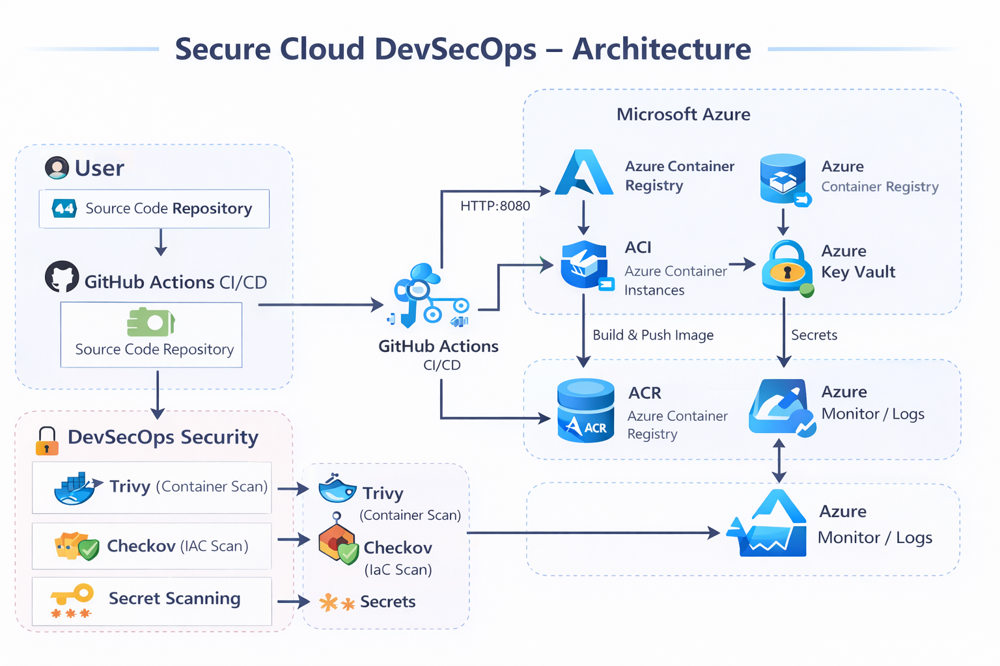

# 🔐 Secure Cloud DevSecOps Platform

A **production-grade DevSecOps application** built using **Node.js, Docker, Terraform, GitHub Actions, and Microsoft Azure**, showcasing secure cloud infrastructure, automated CI/CD pipelines, and security-first practices.

---

## 📌 Project Objective

To design and deploy a **secure cloud-native application** with:
- End-to-end **DevSecOps CI/CD**
- **Infrastructure as Code (IaC)**
- **Container security scanning**
- **Secrets management**
- **Automated cloud deployment**

This project is built to demonstrate **real-world DevOps & DevSecOps skills** suitable for **12–15 LPA product-based roles**.

---

## 🏗️ Architecture Diagram



> **High-level flow**:
User → GitHub → GitHub Actions (CI/CD + Security) → Azure Container Registry → Azure Container Instances → Azure Monitor

---

## 🧠 Architecture Explanation

### 1️⃣ User Layer
- Users access the application via a browser
- Requests are sent over **HTTP (port 8080)**

---

### 2️⃣ Source Control
- Code is hosted in **GitHub**
- Any push to `main` branch triggers the CI/CD pipeline

---

### 3️⃣ CI/CD Pipeline (GitHub Actions)
The pipeline performs:
- Code checkout
- Docker image build
- Security scans
- Image push to Azure Container Registry
- Deployment to Azure Container Instances

---

### 4️⃣ DevSecOps Security
Security is integrated directly into the pipeline:

| Tool     | Purpose |
|--------|--------|
| **Checkov** | Terraform / IaC security scanning |
| **Trivy** | Container vulnerability scanning |
| **Secret Scanning** | Detect hardcoded secrets |

🚫 Pipeline **fails automatically** if critical issues are detected.

---

### 5️⃣ Container Registry
- Docker images are stored in **Azure Container Registry (ACR)**
- Only scanned and validated images are deployed

---

### 6️⃣ Runtime Environment
- Application runs in **Azure Container Instances (ACI)**
- Uses **non-root container user**
- Health check enabled via `/health`

---

### 7️⃣ Secrets Management
- Secrets are stored securely in **Azure Key Vault**
- No secrets are hardcoded in code or Dockerfile

---

### 8️⃣ Monitoring & Logs
- Logs and metrics are sent to **Azure Monitor**
- Health endpoint used for observability and deployment validation

---

## 🛠️ Tech Stack

### Application
- **Node.js**
- **Express.js**
- **Helmet.js** (Security headers)
- **Winston** (Structured logging)

### DevOps & Cloud
- **Docker**
- **Terraform**
- **GitHub Actions**
- **Azure Container Registry**
- **Azure Container Instances**
- **Azure Key Vault**
- **Azure Monitor**

### Security
- **Trivy**
- **Checkov**
- **Secrets Scanning**

---

## 📂 Project Structure

secure-cloud-devsecops-azure/
│
├── app/
│ └── src/
│ ├── server.js
│ └── public/
│ └── index.html
│
├── terraform/
│ ├── main.tf
│ ├── variables.tf
│ ├── outputs.tf
│ └── environments/
│ └── dev/
│ └── terraform.tfvars
│
├── .github/
│ └── workflows/
│ └── devsecops-pipeline.yml
│
├── Dockerfile
├── README.md
└── docs/
└── architecture.png


---

## 🚀 Application Endpoints

| Endpoint | Description |
|--------|------------|
| `/` | Frontend UI |
| `/health` | Health check |
| `/info` | Application metadata |
| `/api` | API information |

---

## 🌍 Live Application Access

http://securecloud-dev-app.eastus.azurecontainer.io:8080


---

## 🔐 Security Best Practices Implemented

- Non-root Docker container
- No secrets in code
- CI/CD security gates
- IaC scanning
- Container vulnerability scanning
- Secure HTTP headers
- Graceful shutdown handling

---

## 🧪 Health Check Example

```bash
curl http://securecloud-dev-app.eastus.azurecontainer.io:8080/health


